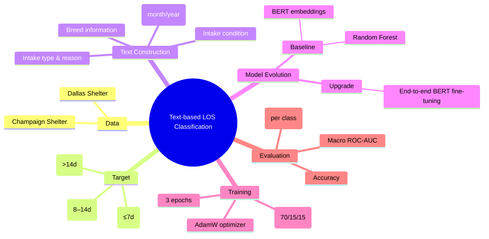

# Abuzar Hussain — Text-based LOS Classification with BERT

## Overview

This component focuses on **text-based modeling** for predicting **Length of Stay (LOS)** categories of dogs in animal shelters.  
Instead of relying solely on structured or one-hot encoded categorical features, we transform intake records into natural language descriptions and leverage **pretrained BERT models** to capture semantic relationships across breed, intake conditions, and shelter metadata.

The task is formulated as a **3-class classification problem**:

- **Short LOS**: ≤ 7 days  
- **Medium LOS**: 8–14 days  
- **Long LOS**: > 14 days  

---

## Modeling Strategy

---

## Step 1: BERT Embeddings + Random Forest (Hybrid Baseline)

**Motivation**  
High-cardinality categorical features (e.g., breed, intake reason) are difficult to encode efficiently with traditional methods. Pretrained language models provide compact semantic representations that can be reused by classical classifiers.

**Method**  
- Convert each dog’s intake record into a short templated sentence.
- Use `bert-base-uncased` to extract the **[CLS] embedding** (max length = 128).
- Train a `RandomForestClassifier` on the extracted embeddings.
- Data split: **70% train / 15% validation / 15% test**, using stratified sampling.

---

## Step 2: End-to-End BERT Fine-tuning

**Motivation**  
While fixed BERT embeddings capture general semantics, they do not adapt to the LOS prediction task. Fine-tuning allows the language model to directly optimize for LOS classification.

**Method**  
- Use `BertForSequenceClassification (bert-base-uncased, num_labels=3)`.
- Optimize with **AdamW** (learning rate = 2e-5).
- Train for **3 epochs** with a linear warm-up schedule.
- Evaluate using the same stratified 70/15/15 split.

---

## Results

### Dallas Dataset — ROC-AUC (per class)

| Model | Short (≤7d) | Medium (8–14d) | Long (>14d) |
|---|---:|---:|---:|
| BERT [CLS] Embedding + Random Forest | 0.887 | 0.784 | 0.891 |
| **BERT Fine-tuned** | **0.898** | **0.797** | **0.904** |

---

### Champaign Dataset — ROC-AUC (per class)

| Model | Short (≤7d) | Medium (8–14d) | Long (>14d) |
|---|---:|---:|---:|
| **BERT Fine-tuned** | **0.96** | **0.78** | **0.93** |

---

## Notes on Evaluation & Deployability

- Current text templates include some **outcome-related fields**, which may introduce **label leakage**.
- For real-world deployment, models should be retrained using **intake-time features only**.
- All results are reported using **stratified random splits**; future work may adopt time-based splits.

---

## Key Takeaways

- Text-based representations are highly effective for LOS classification.
- End-to-end BERT fine-tuning outperforms hybrid embedding-based approaches.
- Language models capture nuanced shelter context that is difficult to encode manually.
