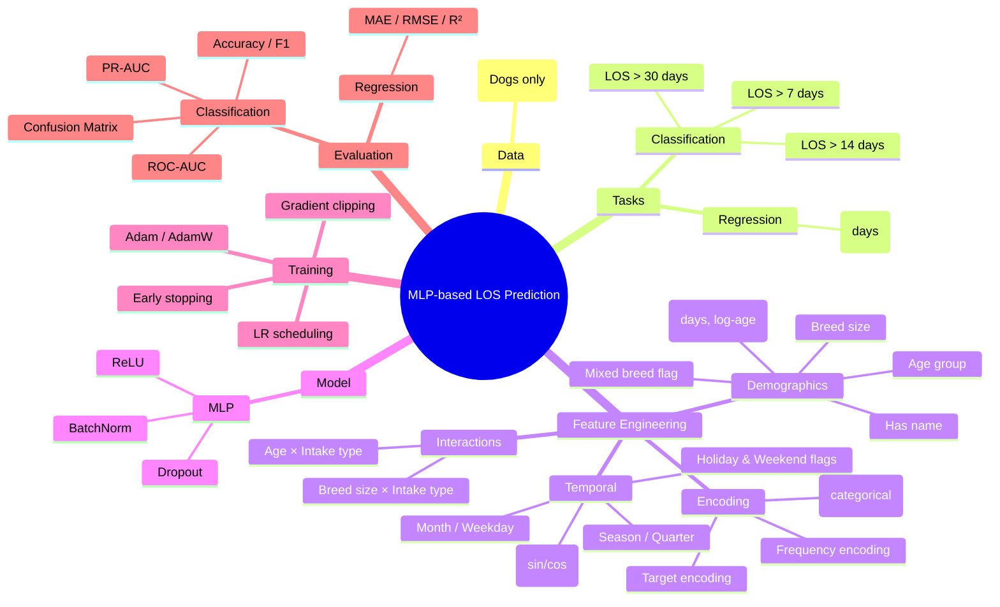

# Brian Hung — Tabular MLP Models for LOS Prediction (Champaign Shelter)

## Overview

This component focuses on **tabular deep learning** for predicting dog **Length of Stay (LOS)** at the Champaign County Animal Shelter.
The work explores **both regression and classification formulations**, supported by extensive feature engineering and a carefully regularized **MLP (Multi-Layer Perceptron)** pipeline.

Two complementary tasks are considered:

- **Regression**: predict continuous LOS (days)
- **Classification**: predict whether LOS exceeds a threshold (**7 / 14 / 30 days**)

---

## Modeling Strategy

---

## Feature Engineering

A major emphasis of this work is **high-quality feature engineering** tailored for tabular data:

- **Age features**: age in days, log-age, age group (puppy / adult / senior)
- **Breed features**: simplified breed size, mixed-breed indicator, top-breed one-hot encoding
- **Temporal features**: intake month, weekday, season, quarter, holidays, weekends
- **Cyclical encoding**: sine/cosine transforms for month and weekday
- **Encoding strategies**:
  - One-hot encoding (fit on training data only)
  - Frequency encoding (train-only statistics)
  - Target encoding with smoothing to reduce overfitting
- **Interaction features**: age × intake type, breed size × intake type

All encodings are computed **after train/validation/test split** to avoid data leakage.

---

## Regression Results — Predicting Continuous LOS

### Training Dynamics

- Training loss decreases steadily.
- Validation loss plateaus early, indicating **overfitting**.

### Predicted vs Actual LOS

- The model systematically **underpredicts long-stay dogs**.
- This reflects the heavy-tailed distribution of LOS values.

### Residual Analysis

- Errors increase with LOS magnitude.
- Long-stay cases dominate regression error, motivating alternative losses or log-transformed targets.

---

## Classification Results — LOS Threshold Prediction

Binary MLP classifiers are trained for three thresholds:

- **LOS > 7 days**
- **LOS > 14 days**
- **LOS > 30 days**

### Performance Summary (Test Set)

| Threshold | Accuracy | Precision | Recall | F1-score | ROC-AUC |
|----------:|---------:|----------:|-------:|---------:|--------:|
| LOS > 7  | 0.885 | 0.891 | 0.965 | 0.927 | 0.878 |
| LOS > 14 | 0.766 | 0.751 | 0.911 | 0.823 | 0.882 |
| LOS > 30 | 0.716 | 0.535 | 0.451 | 0.489 | 0.926 |

---

### ROC & Precision–Recall Curves

- ROC-AUC remains high across thresholds.
- PR curves reveal increasing difficulty for identifying **very long-stay dogs**.

---

### Confusion Matrix (LOS > 30 days)

- High specificity but low recall.
- Many long-stay dogs are missed under a default 0.5 threshold.

---

### Threshold Sensitivity Analysis (LOS > 30 days)

- Lowering the decision threshold significantly improves recall.
- Demonstrates the trade-off between false positives and missed long-stay dogs.

---

## Key Takeaways

- Extensive feature engineering is critical for tabular LOS prediction.
- MLP models perform strongly for **short- and medium-term LOS** classification.
- Long-stay prediction (>30 days) is challenging due to class imbalance and weak signal.
- Threshold tuning is essential for deployment-oriented objectives.

---

## Future Work

- Log-transform or robust loss (Huber/MAE) for regression
- Class-weighted or focal loss for long-stay classification
- Time-based data splits for stricter evaluation
- Integration with text-based representations (e.g., BERT)
